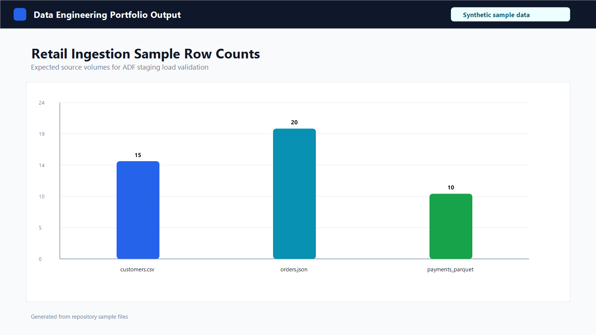
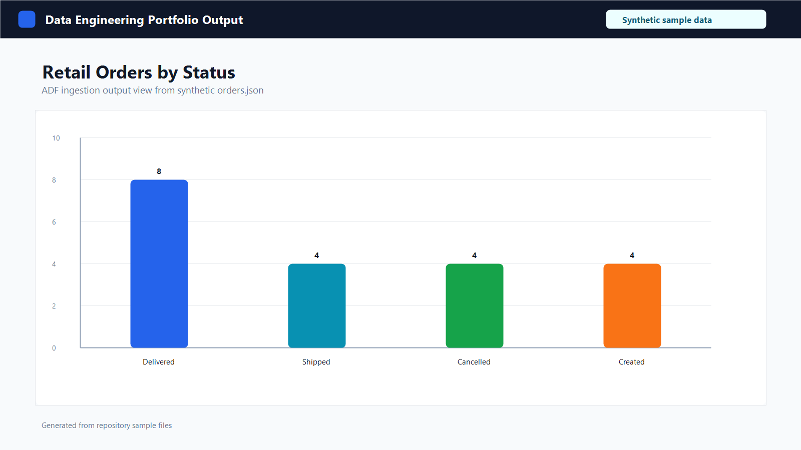
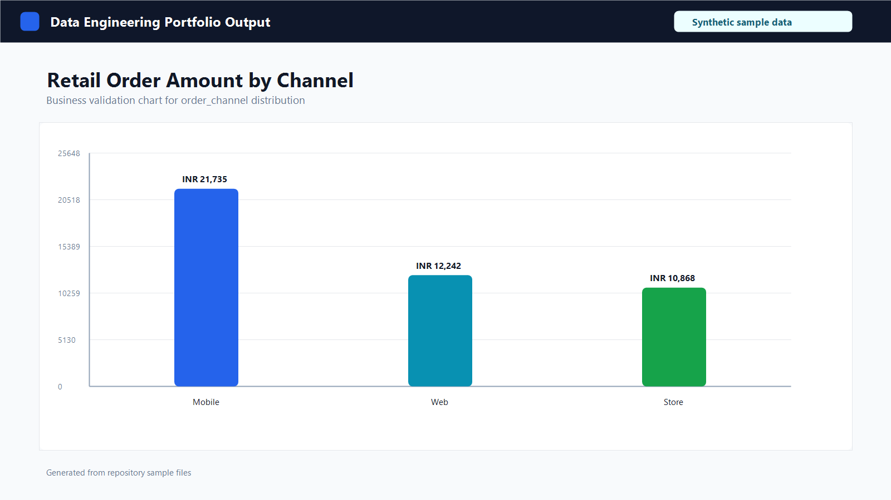

# Azure Data Factory ETL Pipeline for ADLS to Azure SQL

## 1. Business Problem
Retail teams often receive sales, customer, order, and payment files in different formats. A fresher data engineer should understand how to load these files safely into a structured database so analysts can query them with SQL.

This portfolio project shows a learning implementation of a multi-format ingestion pipeline. It is not a real company production pipeline.

## 2. Project Objective
Build an Azure Data Factory design that ingests CSV, JSON, and Parquet files from Azure Data Lake Storage Gen2 or Azure Blob Storage into Azure SQL Database staging tables. The project includes control metadata, audit logging, and failure notification design.

## 3. Tech Stack
- Azure Data Factory
- Azure Data Lake Storage Gen2
- Azure Blob Storage
- Azure SQL Database
- Azure Key Vault basics
- Azure Logic Apps webhook placeholder
- ADF Monitor
- Python standard library
- PySpark for Parquet sample generation
- SQL
- GitHub and VS Code

## 4. Architecture
Source files are placed in ADLS Gen2 or Blob Storage. Azure Data Factory reads active source metadata from Azure SQL, loops through each source, checks the file type, copies the data into matching staging tables, and writes audit records. Failures can call a Logic Apps webhook placeholder.

See `docs/architecture.md` for the text architecture diagram.

## 5. Folder Structure
```text
adf/                         ADF linked service, dataset, pipeline, and trigger templates
data/sample/                 Synthetic CSV and JSON files
data/expected_output/        Expected output notes
docs/                        Setup, runbook, monitoring, and data dictionary
scripts/                     Python and PySpark sample data scripts
sql/                         Azure SQL schema, staging, control, and audit scripts
```

## 6. Dataset
The dataset is synthetic retail data:
- `customers.csv`: customer profile data
- `orders.json`: order header data
- `payments_parquet/`: payment data generated by PySpark

No real customer data is used.

### Output Images
These charts are generated from the synthetic retail sample data included in this repository.







## 7. Processing Flow
1. Generate small sample files locally.
2. Upload sample files to ADLS Gen2 or Blob Storage.
3. Run SQL scripts in Azure SQL Database.
4. Import or recreate the ADF templates.
5. Trigger the pipeline with parameters such as load date and environment.
6. Review staging tables, audit records, and ADF Monitor output.

## 8. How to Run
Generate sample CSV and JSON files:

```bash
python scripts/generate_sample_data.py
```

Generate the Parquet sample in Databricks or any PySpark environment:

```bash
python scripts/generate_parquet_with_pyspark.py
```

Then follow `docs/setup_azure_portal.md` to create Azure resources and import the ADF assets. Replace placeholders such as `<storage-account-name>`, `<container-name>`, and `<database-name>` with your own lab values.

## 9. Data Quality Checks
- Confirm row counts after each copy activity.
- Check required fields such as `customer_id`, `order_id`, and `payment_id`.
- Review duplicate IDs before loading reporting layers.
- Check audit status and error messages after every run.

## 10. Monitoring and Troubleshooting
Use ADF Monitor to review pipeline runs, activity runs, input/output details, and failures. The design includes an audit table and a Logic Apps webhook placeholder for failure notification.

## 11. Key Learnings
- How to organize ADF assets in source control.
- How metadata-driven ingestion works at a beginner level.
- How Azure SQL staging, control, and audit tables support ETL operations.
- Why secrets should be referenced through Key Vault placeholders instead of hardcoded.

## 12. Future Improvements
- Add parameterized file archive handling.
- Add stronger data quality checks in SQL.
- Add more sample file types and folder partitions.
- Add Power BI basics after staging data is validated.
